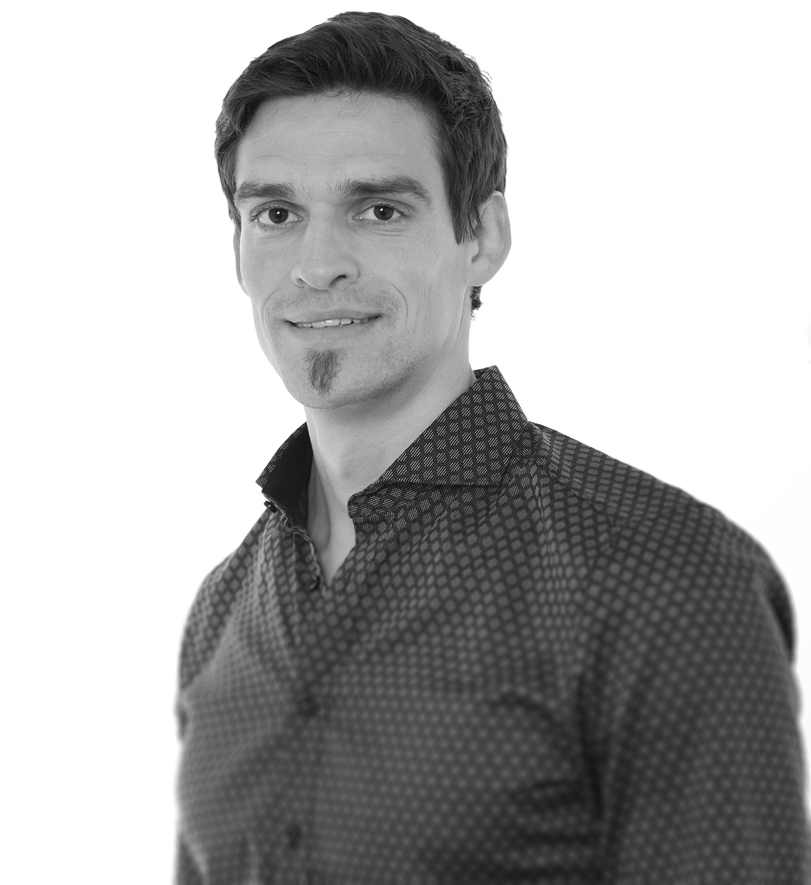

---

## **Biography**
Benjamin Pontiller is a microbial ecologist with a special interest in aquatic ecosystems. He received his BSc in Biology with a specialization in microbiology from the University of Vienna. His curiosity and interest about the paramount role of the “unseen majority” in the global carbon cycle led him to continue in the field of microbial ecology before eventually obtaining his MSc from the University of Vienna. After his graduation, he moved on to Sweden and accepted a PhD position at the Linnaeus University. He received his Ph.D. from Linnaeus University in May 2021. Ben is currently working as a PostDoc at GEOMAR Helmholtz Centre for Ocean Research Kiel (Germany) in [Prof. Anja Engel's group](https://www.geomar.de/en/aengel), in the field of biological oceanography and marine biogeochemistry.

---

## **Research Focus**
Benjamin is currently working on the interaction between bacteria and dissolved organic matter (DOM), a critical component in the earth’s carbon cycle. The main focus of Ben's research is to investigate the functional role of marine bacterioplankton in carbon cycling by deciphering the genetic basis for organic carbon utilization. Dissolved organic carbon (DOC) derived from phytoplankton photosynthesis represents the main biologically available organic carbon pool in the ocean. The uptake and utilization of organic carbon compounds are mainly determined by the metabolic potential
encoded in the genomes of marine bacteria. However, detail on the underlying molecular mechanisms and how they impact the cycling of organic matter remain
largely unknown. Ben's research is based on field studies and experiments with natural marine bacterial assemblages.

Ben's current work focuses on elucidating the functional dynamics of heterotrophic bacteria in the degradation of ecologically relevant sources of organic compounds by applying state-of-the-art techniques currently used in microbiology, microbial ecology and molecular biology such as metagenomics and metatranscriptomics and mainly based on field studies, mesocosm and microcosm experiments.

He is interested in the dynamics of **natural microbial assemblages** and his curiosity goes beyond phylogenetic composition and is dealing with the **functional role** of microbes (What do they do? & Who is doing it?).

---

## **Objectives & Aims**

- What is the functional response of Bacteria to various **labile dissolved organic matter (LDOM)** model compounds? (see <a href="project1.html">**DOM project**</a>),
- What do Bacteria express in different stages of a phytoplankton bloom? (see <a href="project2.html">**ENVISION project**</a>)
- What is the functional role of Bacteria in different **strongly stratified water masses**? (see <a href="project3.html">**KB project**</a>)
- What are the **interactions** between **Bacteria and Eukaryotes**? (see <a href="project4.html">**LMO project**</a> and <a href="project5.html">**Collaborations**</a>)
- What are the **interactions** between **Microbes** and **Zooplankton derived DOM**? (see <a href="project6.html">**Collaborations**</a>)

---

## **Outreach**

This webpage informs about the vital role of microorganisms based on Ben's research activities. He aims to present scientific content about ongoing research in an understandable form with a broader audience. A special focus should be on discussing the relevance of single projects, but more importantly, he'd like to put several projects together and discuss them at a relatively broad level. He aims to communicate science within academia but importantly with society. For those of you who are more interested in details, please take a look in the <a href="publications.html">**Publications**</a> section.

>Hopefully you'll enjoy exploring Ben's webpage and stay tuned!

---

---
