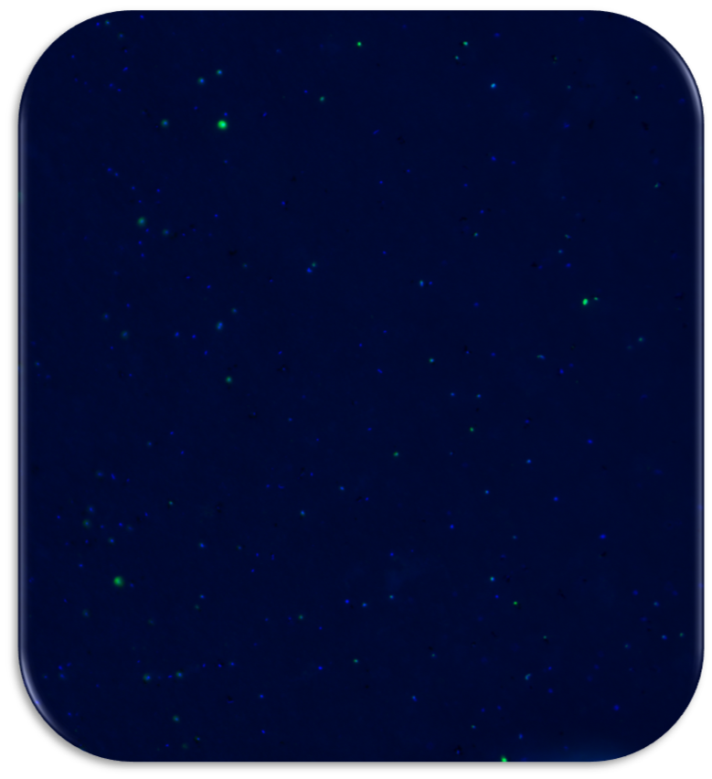

```{r include=FALSE}
#html_document(
# toc = FALSE,
# toc_depth = 3, toc_float = FALSE,
# number_sections = FALSE,
# section_divs = TRUE,
# fig_width = 7,
# fig_height = 5
# fig_retina = 2
# fig_caption = TRUE
# dev = "png",
# df_print = "default",
# code_folding = c("none", "show", "hide"),
# code_download = FALSE
# smart = TRUE
# self_contained = TRUE,
# theme = "default"
# highlight = "default"
# mathjax = "default",
# template = "default",
# extra_dependencies = NULL, css = NULL,
# includes = NULL,
# keep_md = FALSE,
# lib_dir = NULL,
# md_extensions = NULL,
# pandoc_args = NULL, ...)
```

---

## **Some facts:**

- More than 70% of the Earth's surface is covered with water!

- Roughly 50% of the oxygen that we consume is produced by phytoplankton (small algae & cyanobacteria)!

- Thus, processes mediated in aquatic ecosystems are of crucial global importance!

---

## **Did you know that:**

- **1L** seawater contains around **1 billion** microbial cells!

- Microorganisms are the **key players in biogeochemical cycles** for example the carbon cycle with major implications for regulating the climate!

- The total estimated **microbial surface area** is the **largest on this planet**!

---



---

This is an epifluorescence microscopy image of a few mL of seawater. It shows the fluorescence of microbial DNA after staining it with a specific dye. In blue colour you can see mainly *Archaea* and in green mainly *Bacteria* after hybridization with a specific FISH probe (Fluorescence In Situ Hybridization).

---

