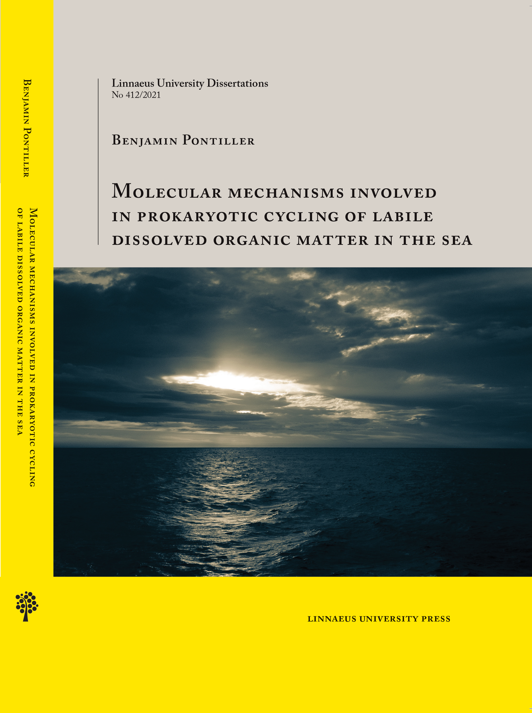

---

## **Ph.D. thesis defense**
I am excited to announce that I successfully defended my Ph.D. thesis *Molecular mechanisms involved in prokaryotic cycling of labile dissolved organic matter in the sea* on Wednesday, May 12th, 2021! A special thanks to my opponent Prof. Martin Polz and the examination committee! It was a fantastic day that I will never forget, and I couldn't have asked for a better outcome!

---

---

## **Upcoming Conferences and Workshops**

to be announced ...

---

---

## **Past Conferences**

- **Workshop Meta Analysis using R**, Department of Biology, Lund University, Lund, Sweden, (18. - 22. February 2019)

- **ASLO 2019 Aquatic Sciences Meeting - PLANET WATER Challenges and Successes**, San Juan, Puerto Rico, USA, Oral presentation: *Distinct responses in bacterioplankton community structure, activity, and gene expression to dissolved organic matter compounds of different complexity*, (23. February - 02. March 2019).

- **SAME16 "From Boat To Bench" - Integrating Field Observations with Lab Experiments**, Potsdam, Germany, (1 - 6 September 2019)

- **ISME17 - 17th International Symposium on Microbial Ecology**, Leipzig, Germany,
Poster presentation: *Pronounced differences in bacterioplankton community composition and gene expression of a pre- and post-phytoplankton bloom in an upwelling system*, (12. - 17. August 2018).

- **Gordon Research Conference (GRC) - Marine Microbes**, Lucca (Barga), Italy,
Poster presentation: *Distinct responses in bacterioplankton community structure, activity, and gene expression to dissolved organic matter compounds of different complexity*, (01. - 06. July 2018).

- **EcoChange Conference, Food Web Efficiency in future climate conditions - integrating biodiversity, production and dynamics**, Linnaeus University, Kalmar, Sweden, (22. – 23. November 2017).

-	**SAME15 – 15th Symposium on Aquatic Microbial Ecology**, Zagreb, Croatia,
Poster presentation: *Distinct responses in bacterioplankton community structure, activity, and gene expression to dissolved organic matter compounds of different complexity*, (03. – 08. September 2017).

---

---

## **Current Collaborations**

- **Microbial Respiration**, Collaboration with Umeå University (Sweden), [Johan Wikner](https://www.umu.se/en/staff/johan-wikner/)  and [Kevin Vikström](https://www.umu.se/en/staff/kevin-vikstrom/)

- **Guest visit** at **JAMSTEC** (Japan Agency for Marine-Earth Science and Technology), Collaborative work on the interaction between Zooplankton and Bacteria, at the Research and Development Center for Marine Biosciences, Japan, Natushima 2-15, Yokosuka, Kanagawa 237-0061, Japan, (04. - 25. June 2018).

- **Guest visit** at the **University of Vigo**, Collaborative work in the frame of the ENVISION-project, Vigo, Spain, (12. - 23. March 2018).

---

> I'll keep you updated about my whereabouts!
Anyway, please get in touch with me in case you are interested in what I'm doing!
I'm always looking for new and exciting projects!
Hope to see you soon!

#### Ben

---

